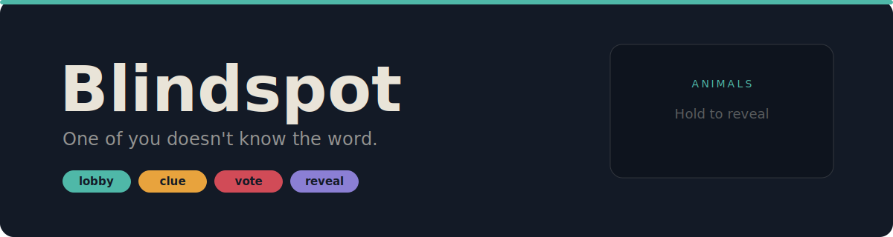
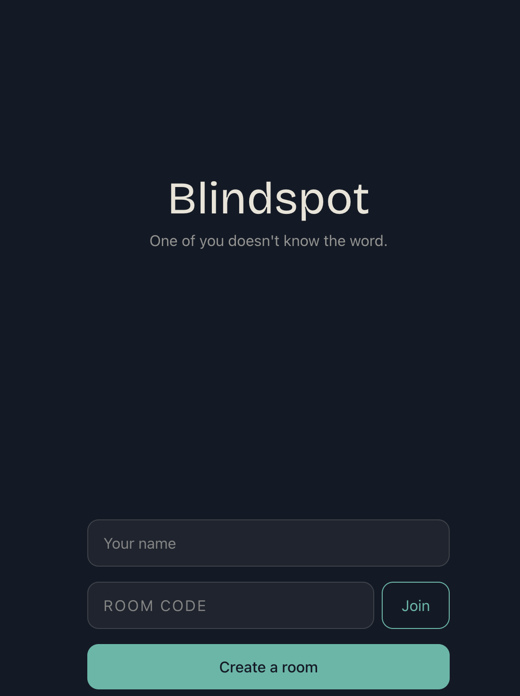
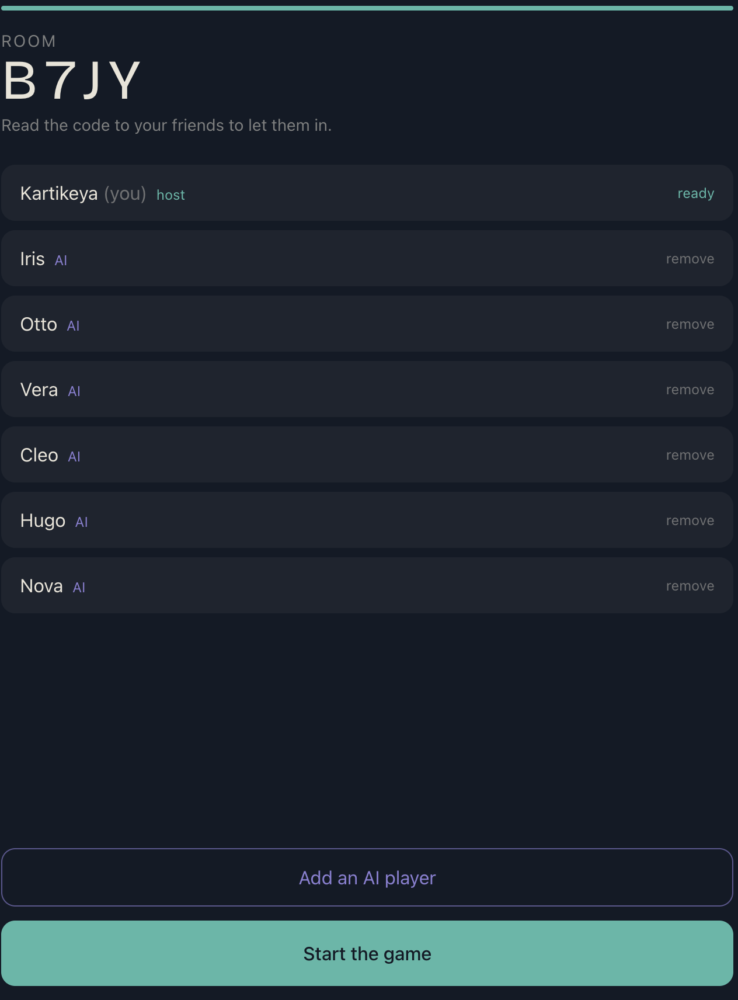
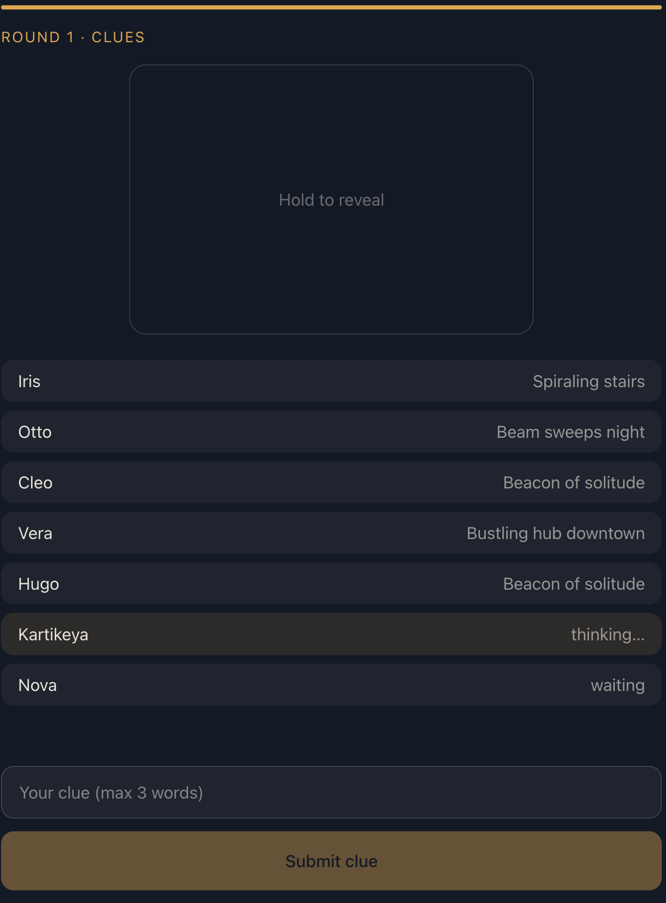
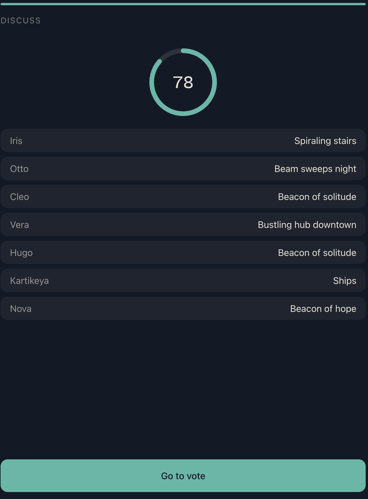
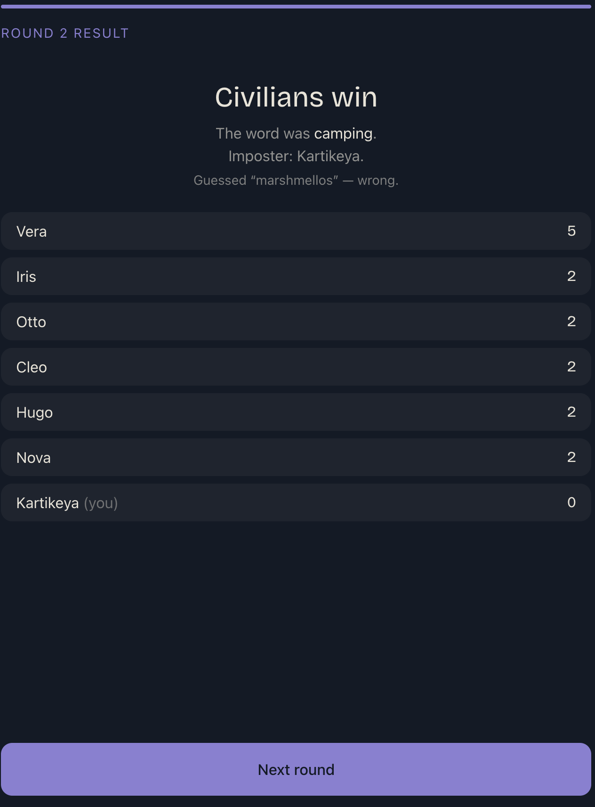
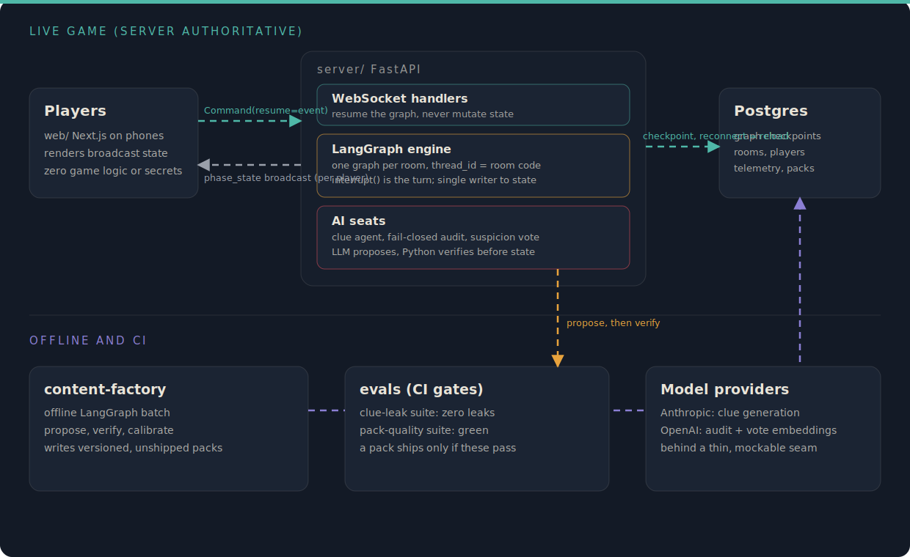

<p align="center">
  
</p>

<p align="center">
  
  
  
  
  
  
  
</p>

# Blindspot

Blindspot is a mobile-first, browser-based social deduction party game with an AI game master. Friends sit around a table, each on their own phone, and one of them does not know the secret word. The civilians give one-word-at-a-time clues, everyone argues, and the table votes on who the imposter is.

The interesting part is underneath. The live game runs on a server-authoritative LangGraph state machine, one graph per room, where every human turn enters through `interrupt()` and every state change is checkpointed to Postgres. Empty seats can be filled by AI players whose clues pass a deterministic, fail-closed audit before they are allowed into game state. An offline content factory generates, verifies, and calibrates the word packs, and an evaluation suite gates every change in CI.

Distribution is private. Friends join in person by room code or QR. There are no accounts, no public lobby, and no matchmaking. Rooms expire after 24 hours of inactivity.

## Screenshots

<table>
  <tr>
    <td width="33%"></td>
    <td width="33%"></td>
    <td width="33%"></td>
  </tr>
  <tr>
    <td align="center"><b>Create or join</b><br>by room code, no account</td>
    <td align="center"><b>Lobby</b><br>fill empty seats with AI players</td>
    <td align="center"><b>Clue round</b><br>hold the card to reveal your word</td>
  </tr>
  <tr>
    <td width="33%"></td>
    <td width="33%"></td>
    <td width="33%"></td>
  </tr>
  <tr>
    <td align="center"><b>Discussion</b><br>server-driven countdown</td>
    <td align="center"><b>Reveal</b><br>verdict, the word, and scores</td>
    <td></td>
  </tr>
</table>

The interface is a poker face: calm, dark, and it shows each player only what they are entitled to see. Each phase recolors the timer ring, the primary button, and the header rule, and nothing else. The role card is the one place motion is spent: press and hold for a slow ink-wipe reveal of your word, release to hide it.

## Architecture

<p align="center">
  
</p>

The diagram splits into two bands.

The top band is the live game, and it is strictly server authoritative. The Next.js client on each phone renders only the phase state the server broadcasts. It holds zero game logic, no role knowledge, and no hidden words. When a player acts, the client sends one message over the WebSocket and the server attaches the player identity from the authenticated socket, never from the client frame. That message becomes a `Command(resume=event)` that resumes the room's LangGraph instance. There is exactly one graph per room, keyed by `thread_id` equal to the room code, and the graph is the single writer to game state. Every human input, that is the clue, the vote, the host action, and the imposter guess, arrives through `interrupt()`, so the graph never polls and the WebSocket handlers never mutate state directly. After each step the server broadcasts a fresh phase state, and per-player private fields such as your role and your word travel only on that player's own socket.

State is checkpointed to Postgres through the LangGraph `AsyncPostgresSaver`. Because the graph is the source of truth and every step is persisted, a reconnect is just a reload and rebroadcast: drop your phone mid-round, reconnect with your token, and the server replays the current phase to you. The same Postgres instance holds the application tables for rooms, players, telemetry, and word packs.

AI seats live inside the server. When it is an AI player's turn, the clue agent asks the model for a clue, then a deterministic audit decides whether it can enter state. The audit fails closed: a clue is rejected if it contains, stem-matches, or rhymes with the secret word, or if its embedding similarity to the word falls outside the calibrated band for the pack difficulty. On failure the graph loops back to the agent with the specific violations, up to three retries, and then falls back to a safe template clue. There is no force-pass path. AI votes are a deterministic suspicion score over the clue embeddings, and the rationale is written to telemetry. To hide latency, AI clues are pre-computed during the human phases of the round, and a pre-computed clue still passes the audit before use.

The bottom band is offline and CI. The content factory is a separate LangGraph batch that proposes candidate words, runs the deterministic verifiers (blocklist, ambiguity, and an embedding-distance band per difficulty), calibrates difficulty against historical win rates, and writes a versioned, unshipped pack to Postgres. A pack ships only after the evaluation suites pass: the clue-leak suite proves the audit accepts zero leaking clues on an adversarial probe set, and the pack-quality suite proves the verifiers accept clean words and reject bad ones. Model access sits behind one thin, mockable seam, so the entire test suite runs offline at zero API cost.

## Game flow

```
lobby -> assign_roles -> clue_round -> discussion -> vote -> resolve
```

The conditional edges follow the rules exactly: a tie at the vote triggers exactly one re-vote restricted to the tied players, a caught imposter gets one 30-second guess at the word, and the match ends at the first to 7 points or 5 rounds, chosen by the host. Civilians see the category and the secret word, the imposter sees only the category. Clues are at most three words, and the server rejects any clue that contains or stem-matches the word, for humans and AI alike, with an inline error and a retry.

## Repository layout

```
web/               Next.js (App Router), TypeScript, Tailwind. Renders broadcast state only.
server/            FastAPI, WebSockets, and the LangGraph game engine. All game logic lives here.
content-factory/   Offline LangGraph batch: propose, verify, and calibrate word packs.
evals/             Clue-leak suite and pack-quality suite. CI gates.
docs/adr/          Architecture decision records. Immutable once accepted.
```

## Getting started

```sh
make setup        # virtualenv, python deps, and web deps
make dev-server   # FastAPI on :8000
make dev-web      # Next.js on :3000
make test         # pytest, every model call mocked, zero API cost
make lint         # ruff and eslint
make typecheck    # mypy and tsc
make evals        # clue-leak and pack-quality suites
make migrate      # alembic upgrade head
```

Configuration is by environment variable (see `.env.example`):

| Variable | Purpose |
| --- | --- |
| `DATABASE_URL` | Postgres, shared by the app tables and the LangGraph checkpointer. Falls back to SQLite for offline dev. |
| `ANTHROPIC_API_KEY` | Server-side clue generation. Without it, AI clues use a deterministic offline path. |
| `MODEL_ID` | Chat model id, defaults to a cheap fast class. |
| `OPENAI_API_KEY` | Embeddings for the clue audit band and suspicion voting. Without it, a deterministic stub is used. |
| `LANGSMITH_TRACING` | Set to `true` to trace every graph step, tagged with the room code. |

## Content factory

```sh
python -m factory.run --category Food Animals --difficulty easy medium   # inspect candidates
python -m factory.run --persist                                          # write a versioned pack
```

## Testing and quality gates

The Python suite runs with every model call mocked, so it is fast, deterministic, and free. Deterministic validators are tested directly with synthetic inputs, and the full game graph is exercised end to end against an in-memory checkpointer. The evaluation suites run in CI on any change that touches prompts, validators, or packs, and they gate the build.

```
117 tests passing   (106 offline suite + 11 evaluation gate)
ruff, mypy, eslint, tsc   all clean
alembic migrations 0001 to 0003   apply on Postgres and SQLite
```

## Telemetry and cost

Every AI clue and vote writes one row to a `telemetry` table that the game loop never reads: tokens in and out, model, computed cost, audit retries, fallback-clue count, AI vote rationales, and reconnect attempts and successes. `GET /admin/cost` and `GET /admin/cost?room=CODE` roll this up into a cost and reconnect-rate dashboard. `GET /admin/similarity?a=...&b=...` returns the cosine similarity between two strings under the active embedder, which is how the audit bands were calibrated.

## Stack

Python 3.11+, FastAPI with native WebSockets, LangGraph with `AsyncPostgresSaver`, and `langchain-anthropic` behind a thin LLM interface. SQLAlchemy 2.0 and Alembic on the same Postgres instance for the application tables. The web client is Next.js App Router with TypeScript in strict mode and Tailwind, with no component library and all client state derived from server broadcasts.

## Decision records

Architecture decisions are recorded under [docs/adr/](docs/adr/), including the fail-closed audit and BYOK key handling. Accepted records are immutable and are superseded by new ones rather than edited.
